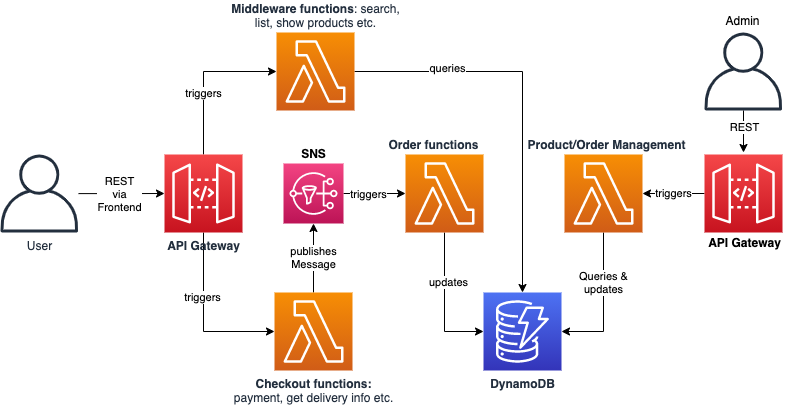
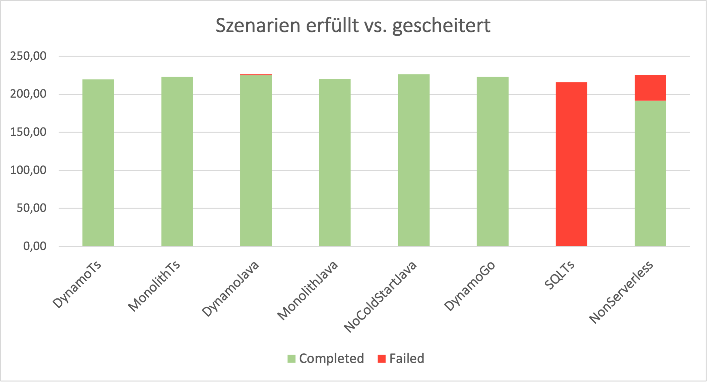
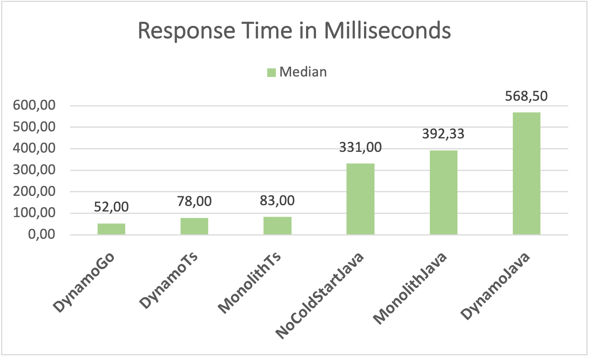
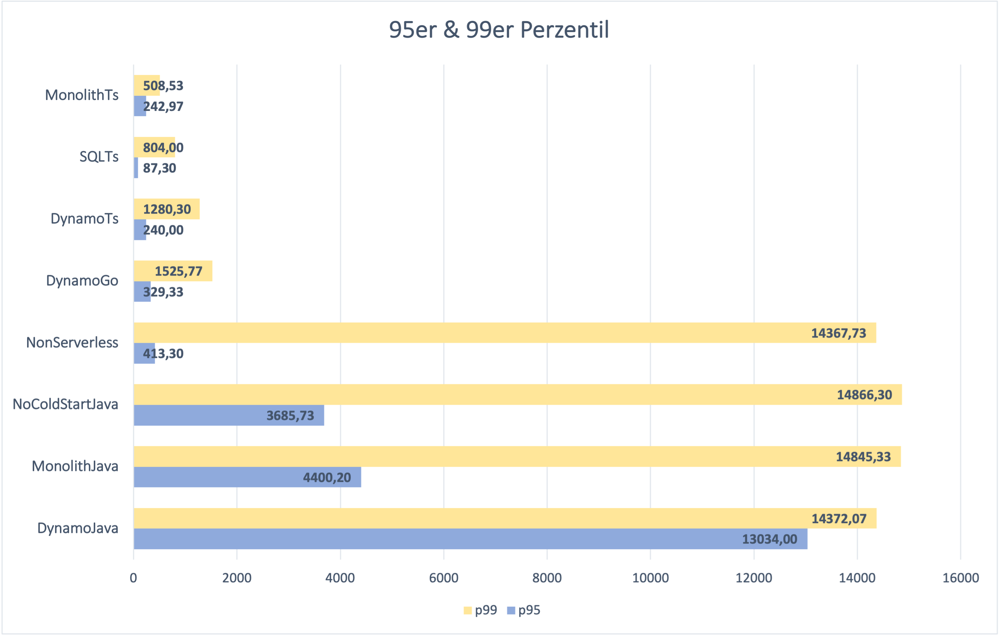
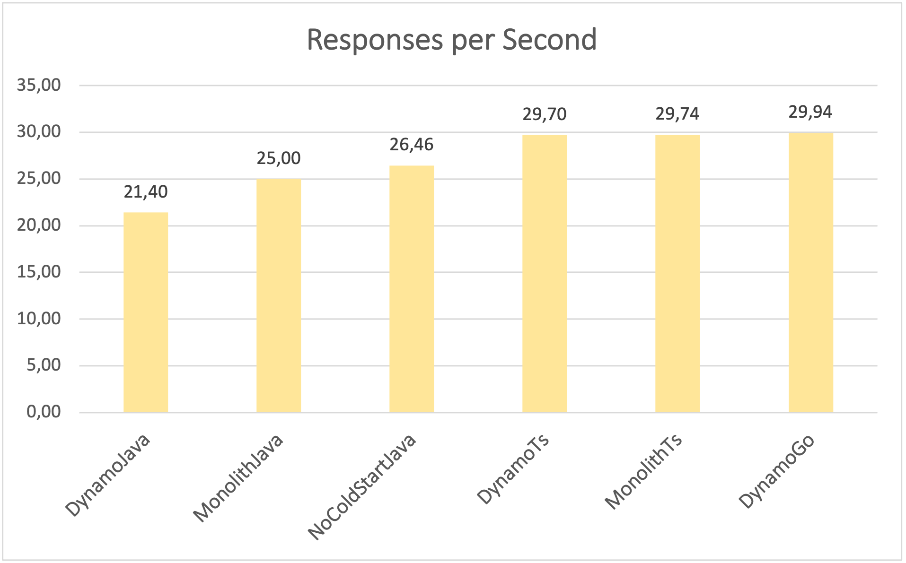

# Serverless Webshop "Royal Plants"
This repository contains an explorational web shop based on a serverless architecture. It serves as the practical part of my bachelor thesis and realises seven different tech stacks to test several aspects of serverless.

## Project Setup

### Requirements
* AWS account
* AWS CLI
* CDK
* Make
* Node
* Go
* Java
* Docker
* Load testing: Artillery (command `artillery run CompleteTestFlow.yml`)


### Build and deploy

Before building and deploying, change the account number and region in the CDK script (`cdk/bin/cdk.ts`).

```javascript
const env = { account: '<account_number>', region: '<aws_region>' }
```

After installing Make and CDK, you can use the Make-commands to deploy the stacks:

```bash
make deploy-base
make deploy-dynamo-ts
```

Your AWS account may need the required IAM permissions to deploy the stack. Some stacks need more adjustments than others like activating a VPC Endpoint, further instructions can be found in the cloud console when the deloy fails.

You can find the other stacks in the `Makefile`.

The database will be initiated with the three needed tables but without any data. You can generate some product data by hand or use the generator endpoint in the dynamoTs stack. With the gernerator you can define how many and in which category (`plant`, `flower` or `edible`) products should be created, note that those products have very generic names and the same standard product image.<br>
The other tables fill up while using the web shop or can also be altered manually.

## Reference Architecture and chosen technologies

The chosen provider is AWS because they "invented" serverless in 2014 by releasing AWS Lambda and it is still the biggest one.
The shops backend consists fully out of small serverless functions, divided into four components: checkout, 
order and shipment, middleware functions (product search, list etc.) and product/order management.
<br>
The deployment is mangaged via AWS Cloud Development Kit (CDK) which builds the needed cloudformation stack for you in an infrastructre as code manner.
The project setup makes direct use of CDK.
<br>
While AWS supports many languages natively this project is written in TypeScript, as it is a very common choice and also used in the [frontend](https://github.com/lucieadw/serverless_frontend).
<br>
Another important choice was the database. In this case the NoSQL database DynamoDB was used because it is the most common choice for serverless on AWS. It holds three tables: `Products`, `Orders` and `Baskets`.
<br>
The API is using REST for all user and admin management endpoints. Those endpoints are placed in AWS API Gateway. Between checkout and order functions AWS Simple Notification Service (SNS) is used for internal communication as it is faster and more reliable than REST.
<br>
The following graphic shows the reference architecture, which was modified in the course of the project.
<br>
<br>


## Seven Experiments
The previously shown reference architecture (aka DynamoTs) was modified seven times to test the performance and usability of different technologies in relation to serverless.
1. Stack MonolithTs: In this stack the number of functions was reduced to one, so that there is a monolithic function which holds the whole code base, distributing tasks via a router.
2. Stack DynamoGo: The used language was changed from TypeScript to Go, all other technologies stayed the same.
3. Stack SQLTs: Instead of DynamoDB a relational database (mySQL) was used, all other technologies stayed the same.
4. Stack DynamoJava: The used language was changed from TypeScript to Java, all other technologies stayed the same.
5. Stack MonolithJava: Here, the functions also were reduced to a monolithic one with a router, but also with a Java backend instead of TypeScript.
6. Stack NoColdStartJava: Java has very high start up times which leads to long cold starts. To tackle that the fifth stack (MonolithJava) was further modified with a ping endpoint to ping the function every five minutes, so it stays warm.
7. Stack NonServerless: The last stack is a classic Java Spring monolith without serverless but with the same functionality. It is primarily for comparison.


-> Amount of test scenarios completed vs. failed for each stack <br>

-> Median response time for every stack, that completed all test scenarios <br>

-> 95 and 99 percentile for each stack <br>

-> Responses per second for every stack that completed all test scenarios <br>

The images above hold the results of the seven stacks in a whole. It shows that the best stacks were DynamoTs, MonolithTs and DynamoGo while SQLTs ans NonServerless were not up for the challenge.

## Further information
If you are interested in any further reading about the (dis-)advantages of servlerss or the results of my experiments, you can read my thesis "Serverless: The Good, the Bad and the Ugly" (written in german).
